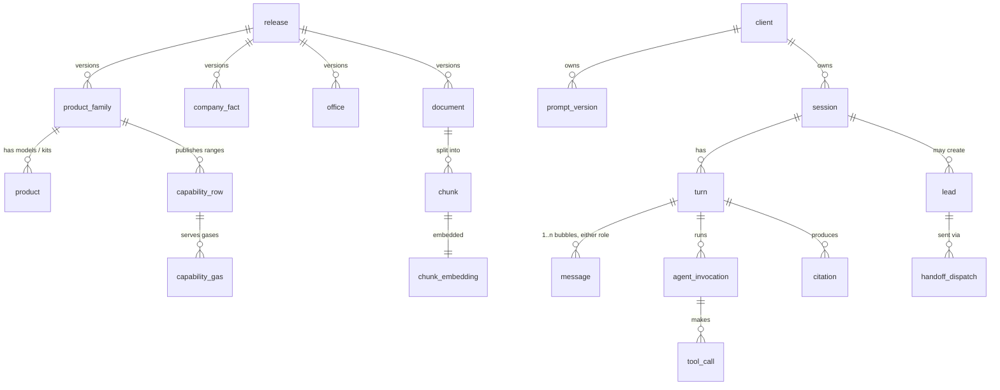

# Jyotech Agent — Data Model (Iteration 1)

Same shape as the C&S build: a **read-only fact schema** produced by ingestion and swapped in per release, a **vector schema** keyed by release, and an **operational schema** that the runtime writes to. All three live in one Postgres database for this iteration (`jyotech_v1`), in separate schemas so the fact schema can be rebuilt without touching conversation history.

The second half of the document follows one conversation end to end and shows the exact rows it creates or reads in every table, so the data flow is visible rather than implied.

---

## 1. Entity overview



---

## 2. Fact schema — `facts.*`

Produced by the ingestion pipeline, reviewed once, tagged with a `release_id`. The runtime reads only the release marked `is_active`.

### 2.1 `facts.release`

| column | type | notes |
|---|---|---|
| release_id | text PK | e.g. `r2026.08.1` |
| built_at | timestamptz | |
| source_manifest | jsonb | URLs + PDF hashes ingested |
| is_active | bool | exactly one true |
| notes | text | |

```
release_id    | built_at            | is_active | source_manifest (abridged)
r2026.08.1    | 2026-08-22 09:10+05:30 | true   | {"pages":11,"pdfs":["PROCESS.pdf#sha256:4f1c…","F&S.pdf#sha256:9ab0…"]}
```

### 2.2 `facts.product_family`

The unit the public content actually describes. Models hang off it where the F&S catalogue names them.

| column | type | notes |
|---|---|---|
| family_id | text PK | stable slug |
| release_id | text FK | |
| division | text | `industrial` / `fire_rescue` / `diving` |
| category | text | menu-level grouping on the website |
| name | text | |
| summary | text | 1–2 sentences, verbatim-derived |
| applications | text[] | |
| standards | text[] | |
| source_doc_id | text FK → document | |
| source_locator | text | page/section in that doc |

```
family_id            | division    | category                         | name                         | standards                     | source_doc_id | source_locator
fam.oxygen_recip     | industrial  | Process Gas Compressors          | Oxygen Compressor            | {API-618 or equivalent}       | doc.process   | §Oxygen Compressors
fam.process_recip    | industrial  | Process Gas Compressors          | Process Gas Compressor       | {API-618 or equivalent}       | doc.process   | §Process Compressors
fam.natgas_hbo       | industrial  | Process Gas Compressors          | Natural Gas Compressor       | {API-11P, ISO 13631}          | doc.process   | §Natural Gas Compressors
fam.diaphragm        | industrial  | Process Gas Compressors          | Diaphragm Compressor         | {}                            | doc.process   | §Diaphragm
fam.cng_booster      | industrial  | CNG / Bio-Gas Compressors        | CNG & Bio-Gas Booster        | {}                            | doc.process   | §Self-fuelling
fam.h2_fuelling      | industrial  | Hydrogen Compressors & Fuelling  | Hydrogen Fuelling System     | {}                            | doc.process   | §Hydrogen
fam.asp              | industrial  | Process Engineering              | Air Separation Plant         | {}                            | doc.process   | §ASP
fam.mch_bac          | fire_rescue | Breathing Air Compressors        | MCH Series Breathing Air Compressor | {EN 12021}             | doc.fs        | §Breathing Air Compressors
fam.lifting_bags     | fire_rescue | Rescue Equipment                 | Air Lifting Bags             | {}                            | doc.fs        | §Air Lifting Bags
fam.scba             | fire_rescue | PPE                              | Self-Contained Breathing Apparatus | {}                      | doc.fs        | §PPE
fam.diving_masks     | diving      | Diving Equipment                 | Full-Face Diving Masks       | {}                            | doc.fs        | §Diving
```

### 2.3 `facts.product`

Named models / variants / kits. Sparse for industrial (ranges only), populated for fire/rescue/diving where the catalogue gives names.

| column | type | notes |
|---|---|---|
| product_id | text PK | |
| family_id | text FK | |
| model_name | text | as printed, exact casing |
| variant | text | nullable |
| description | text | verbatim-derived |
| attributes | jsonb | only what is printed (e.g. drive, fill rate if stated) |
| source_doc_id / source_locator | | |

```
product_id          | family_id        | model_name     | variant       | attributes (only if printed)
prd.mch6            | fam.mch_bac      | MCH-6          | null          | {"portability":"portable"}
prd.mch13_16        | fam.mch_bac      | MCH-13/16      | null          | {}
prd.mch21_23_smart  | fam.mch_bac      | MCH-21/23      | SMART         | {}
prd.mch_mark3       | fam.mch_bac      | MCH            | MARK3 SILENT  | {}
prd.bag_vega        | fam.lifting_bags | VEGA           | high pressure | {"spec_table":true}
prd.bag_nova        | fam.lifting_bags | NOVA           | low pressure  | {"spec_table":true}
prd.neptune3        | fam.diving_masks | NEPTUNE III    | null          | {}
prd.proeye951       | fam.search_eq    | PROEYE 951.S   | 951.S.IN      | {}
```

### 2.4 `facts.capability_row` + `facts.capability_gas`

The range envelope per family (see earlier explanation). Gases normalised to one row per gas so `match_capability` is a plain filter.

| column | type | notes |
|---|---|---|
| cap_id | text PK | |
| family_id | text FK | |
| comp_type | text | |
| lubricated | bool | null = not stated |
| cooling | text | |
| capacity_min / capacity_max | numeric | null = not stated |
| capacity_unit | text | `Nm3/hr` or `SCMD` |
| discharge_p_min / discharge_p_max | numeric | |
| pressure_unit | text | `barg` |
| driver | text[] | |
| standards | text[] | |
| source_doc_id / source_locator | | |

```
cap_id  | family_id         | comp_type                                  | lubricated | cooling | capacity_min | capacity_max | capacity_unit | discharge_p_max | driver                      | standards
cap.001 | fam.oxygen_recip  | reciprocating, vertical/V/W/horizontal     | false      | water   | null         | 20000        | Nm3/hr        | 50              | {electric motor}            | {API-618 or equivalent}
cap.002 | fam.process_recip | reciprocating, vertical/V/W/horizontal     | false      | water   | null         | 20000        | Nm3/hr        | 1000            | {electric motor}            | {API-618 or equivalent}
cap.003 | fam.natgas_hbo    | reciprocating, horizontal balanced-opposed | true       | air     | 10000        | 100000       | SCMD          | 120             | {gas engine, electric motor}| {API-11P, ISO 13631}
```

`facts.capability_gas (cap_id, gas)`

```
cap.001 | oxygen
cap.002 | hydrogen
cap.002 | hydrocarbon gas
cap.002 | natural gas
cap.002 | BOG
cap.002 | mixed gas
cap.003 | natural gas
```

### 2.5 `facts.company_fact`

Typed key/value for everything the Documents & Compliance agent answers.

| column | type |
|---|---|
| fact_id | text PK |
| kind | text — `certification`, `founded`, `founder`, `industry_served`, `client`, `facility`, `coverage`, `contact` |
| value | text |
| detail | jsonb |
| source_doc_id / source_locator | |

```
fact_id  | kind             | value                         | detail                              | source
cf.001   | certification    | ISO 9001:2015                 | {}                                  | about.html
cf.002   | certification    | ISO 14001:2015                | {}                                  | about.html
cf.003   | certification    | ISO 45001:2018                | {}                                  | about.html
cf.004   | founded          | 1991                          | {"founder":"Deepak Bhatia"}         | about.html
cf.005   | facility         | Manufacturing, Greater Noida  | {"count":2}                         | about.html
cf.011   | industry_served  | City Gas Distribution         | {}                                  | index.php
cf.020   | client           | IOCL                          | {"sector":"oil & gas"}              | about.html
cf.021   | client           | NDRF                          | {"sector":"disaster management"}    | about.html
cf.030   | coverage         | Nepal, Bangladesh, Bhutan, Middle East | {}                         | about.html
cf.040   | contact          | sales@jyotech.com             | {"purpose":"sales"}                 | index.php
```

### 2.6 `facts.office`

```
office_id | name            | city     | region | address                                   | phone            | email             | serves_divisions          | source
off.noida | Head Office     | Noida    | North  | G-141, Sector 63, Noida 201301, UP        | +91-120-4711300  | info@jyotech.com  | {industrial,fire_rescue,diving} | contact.php
off.mum   | Mumbai Office   | Mumbai   | West   | (as printed)                              | (as printed)     | null              | {…}                       | doc.fs
off.kol   | Kolkata Office  | Kolkata  | East   | (as printed)                              | (as printed)     | null              | {…}                       | about.html
off.chn   | Chennai Office  | Chennai  | South  | (as printed)                              | (as printed)     | null              | {…}                       | doc.fs
off.sgp   | Singapore       | Singapore| Intl   | (as printed)                              | (as printed)     | null              | {…}                       | doc.process
```

`region` is what after-sales routing keys on; a small `region_state` lookup (state → region) lets the bot map "Coimbatore" → South → `off.chn`.

### 2.7 `facts.document` and `facts.chunk`

```
doc_id       | kind     | title                                               | url                                                    | division    | sha256   | page_count
doc.process  | pdf      | Catalogue – Industrial Compressors & Process Eqpt   | https://www.jyotech.com/pdf/Jyotech%20Catalog%20-%20PROCESS.pdf | industrial | 4f1c… | 1
doc.fs       | pdf      | Catalogue – Fire Rescue & Diving Equipment          | https://www.jyotech.com/pdf/Jyotech%20Catalog%20-%20F&S.pdf     | fire_rescue | 9ab0… | n
doc.about    | html     | About Us                                            | https://www.jyotech.com/about.html                     | all         | …        | 1
doc.pgc      | html     | Process Gas Compressors                             | https://www.jyotech.com/process-gas-compressors.html   | industrial  | …        | 1
```

`facts.chunk`

| column | type |
|---|---|
| chunk_id | text PK |
| doc_id | text FK |
| release_id | text FK |
| locator | text (page / heading path) |
| heading_path | text[] |
| content_md | text |
| token_count | int |
| family_ids | text[] — families this chunk talks about |
| tsv | tsvector (FTS) |

```
chunk_id           | doc_id      | locator            | heading_path                                  | family_ids            | content_md (abridged)
ch.process.0003    | doc.process | p1 §Process        | {Products, Process Compressors}               | {fam.process_recip}   | "Reciprocating, Non-Lubricated, Water Cooled … Capacity up to 20,000 Nm³/hr, Discharge up to 1,000 Barg … Hydrogen, hydrocarbon gases, natural gas, BOG, mixed gas … API-618 or equivalent"
ch.fs.0042         | doc.fs      | p? §Breathing Air  | {Fire & Safety, Breathing Air Compressors}    | {fam.mch_bac}         | "MCH-13/16 … electric or engine driven … suitable for fire stations …"
ch.about.0001      | doc.about   | §Certifications    | {About Us}                                    | {}                    | "ISO 9001:2015, ISO 14001:2015, ISO 45001:2018 certified …"
```

### 2.8 `vec.chunk_embedding_<release>`

One table per release, as in C&S. `(chunk_id PK, embedding vector(1024), model text, created_at)` with an HNSW index.

---

## 3. Operational schema — `ops.*`

Written at runtime. Never rebuilt; grows indefinitely for now.

### 3.1 `ops.client` and `ops.prompt_version`

```
client_id | name                | domain          | theme (jsonb)                         | active_release | handoff_to
jyotech   | Jyotech Engineering | www.jyotech.com | {"primary":"#0B3C5D","logo":"…"}      | r2026.08.1     | {"sales":"sales@jyotech.com"}
```

```
prompt_id | client_id | agent               | version | is_active | body (abridged)                                   | created_at
pv.001    | jyotech   | triage              | 3       | true      | "You classify visitor messages for Jyotech …"     | 2026-08-22
pv.002    | jyotech   | application_discovery | 2     | true      | "Ask one missing slot at a time …"                | 2026-08-22
pv.003    | jyotech   | handoff             | 1       | true      | "Collect name, company, phone …"                  | 2026-08-22
```

### 3.2 `ops.session`

| column | type |
|---|---|
| session_id | uuid PK |
| client_id | text FK |
| started_at / last_seen_at / ended_at | timestamptz |
| release_id | text — pinned for the session |
| landing_url | text |
| user_agent, ip, cookie_id | text |
| locale_detected | text |
| lead_id | uuid nullable |
| end_reason | text — `idle`, `closed`, `handoff` |

### 3.3 `ops.message`, `ops.turn`

`turn` is one orchestrator pass and the parent of agent and tool logs. `message` is every bubble the widget shows; a turn owns **one or more messages in either role** (two quick user messages can trigger one pass; one pass can emit an answer, a follow-up question, a status bubble and a document card as separate messages), so the FK lives on the message: `message (message_id, session_id, turn_id FK, seq_in_turn, role, kind ∈ {text, document_card, status, form}, text, payload jsonb, at)`.

| `ops.turn` column | notes |
|---|---|
| turn_id | uuid PK |
| session_id | FK |
| seq | int |
| started_at / completed_at | timestamptz |
| triage | jsonb — division, intent, language, in_scope, confidence |
| routed_agent | text |
| grounding | jsonb — `{"claims":n,"grounded":n,"status":"full|partial|none"}` |
| outcome | text — `answered`, `asked_slot`, `declined_oos`, `handoff` |
| latency_ms | int |

### 3.4 `ops.agent_invocation`, `ops.tool_call`

```
agent_invocation: inv_id, turn_id, agent, prompt_id, input (jsonb), output (jsonb), slots (jsonb), tokens_in, tokens_out, latency_ms
tool_call:        call_id, inv_id, tool, args (jsonb), result_summary (jsonb), rows_returned, latency_ms
```

### 3.5 `ops.citation`

```
citation_id | turn_id | kind   | ref_id          | locator            | url
```

### 3.6 `ops.lead` and `ops.handoff_dispatch`

| `ops.lead` column | notes |
|---|---|
| lead_id | uuid PK |
| session_id | FK |
| lead_type | `rfq`, `product_enquiry`, `after_sales`, `commercial`, `documents`, `dealer` |
| division | |
| contact | jsonb — name, company, phone, whatsapp_ok, email, city, state |
| consent_at | timestamptz |
| enquiry | jsonb — structured slots captured by the sub-agent |
| matched_family_id | nullable |
| route_to | text[] — emails |
| region | |
| reference_no | text — shown to the user, e.g. `JYO-2608-0142` |
| status | `new` → `dispatched` → (later: `acknowledged`) |

`handoff_dispatch (dispatch_id, lead_id, channel='email', to, subject, body_md, sent_at, provider_msg_id, status)`

---

## 4. One conversation, end to end

Visitor on `process-gas-compressors.html`, 22 Aug 2026, 11:04 IST.

**Turn 1 — user:** "We need to compress hydrogen, about 3000 Nm3/hr from 20 bar to 350 bar for a refinery. Oil-free is mandatory."

Rows written / read:

```
ops.session
  session_id 7c1e…  client jyotech  release r2026.08.1  landing /process-gas-compressors.html
  ua "Chrome/128 Windows"  ip 103.x.x.x  cookie_id cj_9f…  locale en-IN  started 11:04:12

ops.message  m1  session 7c1e…  role user  text "We need to compress hydrogen…"

ops.turn  t1  seq 1
  triage {"division":"industrial","intent":"application_enquiry","language":"en","in_scope":true,"confidence":0.94}
  routed_agent application_discovery

ops.agent_invocation  inv1  turn t1  agent triage  prompt pv.001
ops.agent_invocation  inv2  turn t1  agent application_discovery  prompt pv.002
  slots {"gas":"hydrogen","capacity":3000,"capacity_unit":"Nm3/hr","suction_p":20,"discharge_p":350,"lubricated":false,"industry":"refinery","standard":null,"driver":null,"timeline":null}

ops.tool_call  c1  inv2  tool match_capability
  args {"gas":"hydrogen","capacity":3000,"capacity_unit":"Nm3/hr","discharge_p":350,"lubricated":false}
  result_summary {"matches":[{"cap_id":"cap.002","family_id":"fam.process_recip","headroom":{"capacity":0.85,"pressure":0.65}}],"near_edge":false}
  rows_returned 1                                   ← read facts.capability_row ⋈ capability_gas

ops.tool_call  c2  inv2  tool search_documents
  args {"query":"process gas compressor hydrogen API-618","division":"industrial","family_ids":["fam.process_recip"],"k":3}
  result_summary {"chunk_ids":["ch.process.0003","ch.pgc.0002"]}   ← read vec.chunk_embedding_r2026_08_1 + facts.chunk

turn t1.grounding {"claims":4,"grounded":4,"status":"full"}
ops.citation  ct1 t1 kind chunk ref ch.process.0003 locator "PROCESS.pdf §Process Compressors"
ops.citation  ct2 t1 kind capability ref cap.002
ops.message  m2  role assistant
  text "That duty sits inside our reciprocating, non-lubricated process gas compressor range (API-618 or equivalent), published up to 20,000 Nm³/hr and 1,000 barg [1]. Exact frame and staging come from our engineers. Do you need a specific standard (API-618 vs equivalent), and is there a target delivery timeline?"
turn t1.outcome asked_slot   latency_ms 2870
```

**Turn 2 — user:** "API-618 preferred. Need it commissioned by Q2 next year. Can you send an RFQ to your team?"

```
ops.message m3 user
ops.turn t2 seq 2  triage {"intent":"application_enquiry",…}  routed_agent application_discovery
ops.agent_invocation inv3 agent application_discovery  slots {…,"standard":"API-618","timeline":"Q2 2027"}
  output {"action":"handoff","reason":"user_requested_rfq"}
ops.agent_invocation inv4 agent handoff  prompt pv.003
ops.message m4 assistant "Happy to. I'll need a few details for our engineers: your name, company, phone (WhatsApp OK?), email and city."
turn t2.outcome asked_slot
```

**Turn 3 — user:** "Ravi Menon, Petrochem Projects Ltd, +91 98xxxxxx21 (WhatsApp fine), ravi.menon@petrochem.example, Kochi."

```
ops.message m5 user
ops.turn t3 seq 3  routed_agent handoff
ops.agent_invocation inv5 agent handoff
ops.tool_call c3 inv5 tool get_office  args {"state":"Kerala"}  result {"office_id":"off.chn","region":"South"}   ← read facts.office + region_state

ops.lead  L1
  session 7c1e…  lead_type rfq  division industrial  region South
  contact {"name":"Ravi Menon","company":"Petrochem Projects Ltd","phone":"+91 98xxxxxx21","whatsapp_ok":true,"email":"ravi.menon@petrochem.example","city":"Kochi","state":"Kerala"}
  consent_at 11:07:40
  enquiry {"gas":"hydrogen","capacity":3000,"capacity_unit":"Nm3/hr","suction_p":20,"discharge_p":350,"lubricated":false,"standard":"API-618","industry":"refinery","timeline":"Q2 2027"}
  matched_family_id fam.process_recip
  route_to {sales@jyotech.com}
  reference_no JYO-2608-0142   status new

ops.handoff_dispatch  D1  lead L1  channel email  to sales@jyotech.com
  subject "[JYO-2608-0142] RFQ – Hydrogen process gas compressor, 3000 Nm3/hr @ 350 barg, Petrochem Projects Ltd (Kochi)"
  body_md  (contact block, enquiry table, matched family + catalogue link, 3-line transcript summary, session id)
  sent_at 11:07:41  provider_msg_id <…>  status sent
→ lead.status dispatched   session.lead_id L1

ops.message m6 assistant
  "Sent. Your reference is JYO-2608-0142. Our sales team will contact you on +91 98xxxxxx21 (WhatsApp) within one working day. The enquiry is also summarised for our Chennai office, which covers Kerala."
turn t3.outcome handoff
ops.session  ended_at 11:09:02  end_reason handoff
```

Read-only touches during this conversation: `facts.capability_row` ×1, `facts.capability_gas` ×1, `vec.chunk_embedding` ×1, `facts.chunk` ×1, `facts.office` ×1. Writes: 1 session, 6 messages, 3 turns, 5 agent invocations, 3 tool calls, 2 citations, 1 lead, 1 dispatch.

---

## 5. A second, shorter path — after-sales

**User:** "Need spares for MCH-16 in Chennai."

```
turn t1 triage {"division":"fire_rescue","intent":"after_sales","in_scope":true}  routed_agent after_sales_intake
tool_call get_product {"model":"MCH-16"}  → prd.mch13_16 (fam.mch_bac)         ← facts.product
tool_call get_office  {"city":"Chennai"}  → off.chn                              ← facts.office
assistant: confirms model family, asks serial/year, site, part/issue, preferred contact
… (one more turn) …
ops.lead  lead_type after_sales  division fire_rescue  region South
  enquiry {"model":"MCH-16","family_id":"fam.mch_bac","serial":"…","site":"Chennai","need":"spares – filter cartridge","preferred_contact":"phone"}
  route_to {sales@jyotech.com, <off.chn email or sales@ if none printed>}
handoff_dispatch → email
```

---

## 6. Tool → table map

| tool | reads | typical filter |
|---|---|---|
| match_capability | capability_row ⋈ capability_gas ⋈ product_family | gas ∈, capacity ≤ max (≥ min if set), discharge_p ≤ max, lubricated, unit conversion Nm3/hr↔SCMD |
| list_products | product_family, product | division, category |
| get_product | product ⋈ product_family | model_name ILIKE / alias |
| search_documents | chunk_embedding ⋈ chunk ⋈ document | division, family_ids, hybrid (vector + FTS) |
| get_company_fact | company_fact | kind |
| get_office | office ⋈ region_state | city / state / region |

---

## 7. Deltas from the C&S data model

Dropped: `sku_fact`, `taxonomy_level`, price tables, compare tools. Added: `capability_row`/`capability_gas`, `office` + `region_state`, `company_fact`, and — moved from a later phase to day one — `lead` + `handoff_dispatch` with a user-visible `reference_no`. `chunk.family_ids` replaces SKU tagging as the retrieval pre-filter. Everything else (sessions, turns, agent invocations, tool calls, prompt versions in DB, per-release embedding tables) is carried over unchanged so the framework's onboarding tooling still applies.
