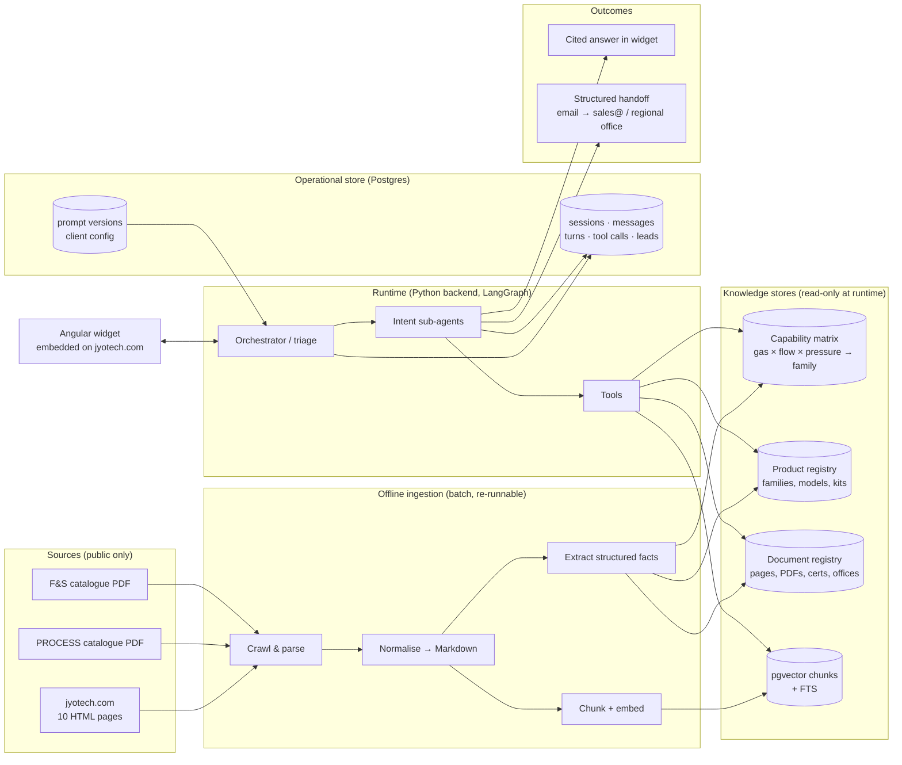
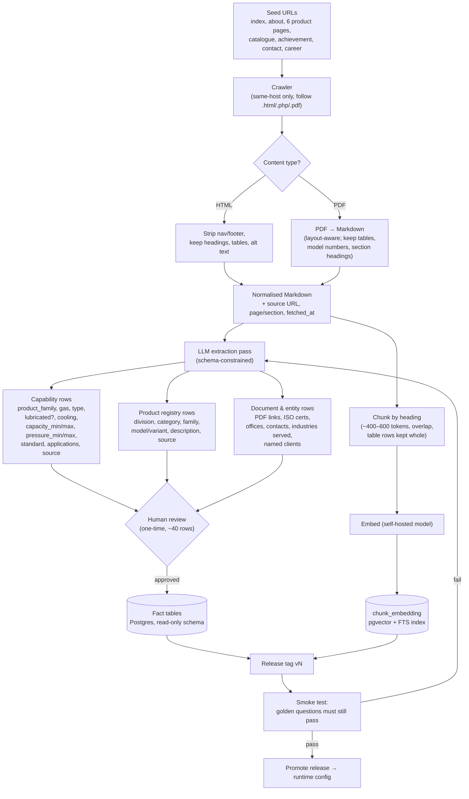
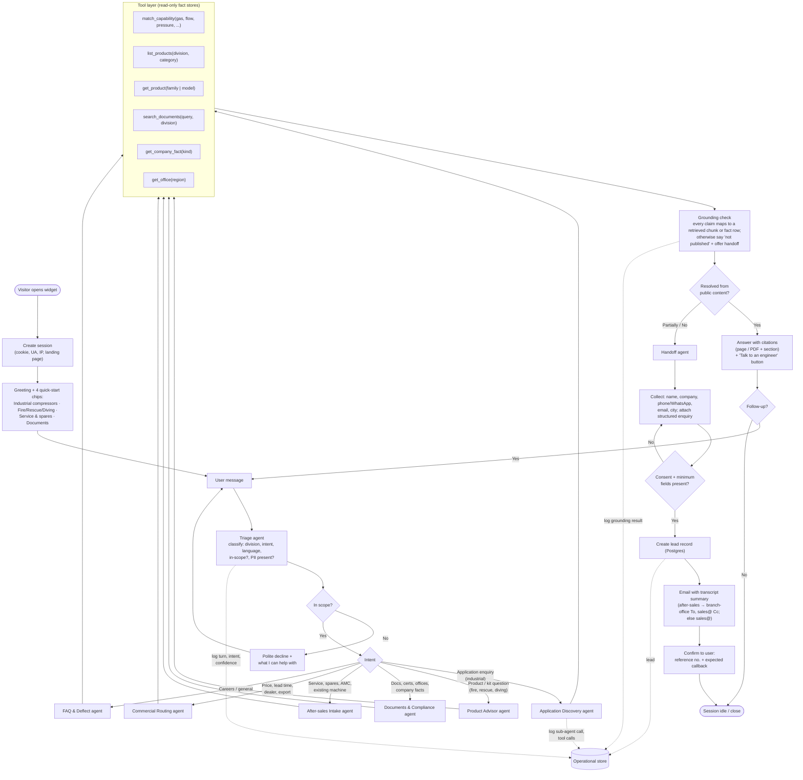
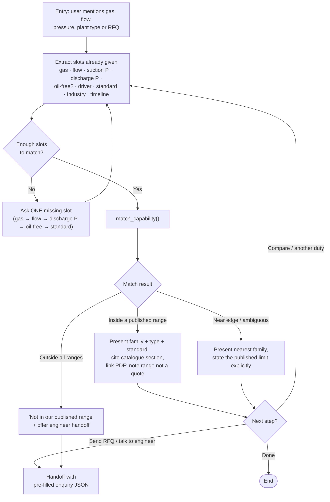
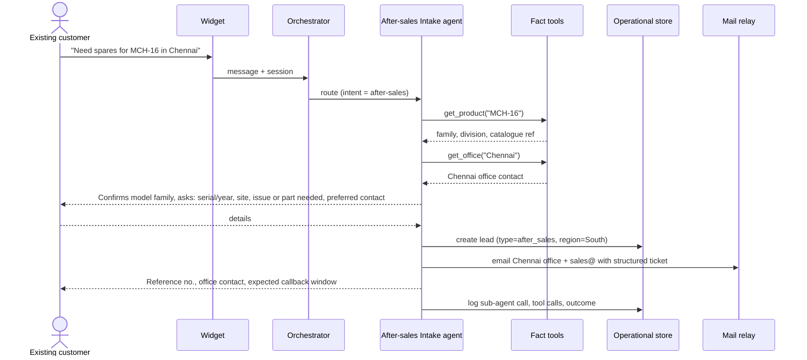

# Jyotech Agent — End-to-End Flow (Iteration 1)

Scope for iteration 1: knowledge comes **only** from the public website (≈10 pages) and the two catalogue PDFs (`Jyotech Catalog - PROCESS.pdf`, `Jyotech Catalog - F&S.pdf`). No client-supplied datasheets, price lists or CRM integration yet. Every path that needs something outside that scope ends in a structured human handoff to `sales@jyotech.com` / regional office.

The flow is drawn in four layers, top-down: the overall pipeline, the offline ingestion that builds the knowledge stores, the runtime conversation loop, and the sub-agent / handoff detail. Diagram 3 is the one engineers will build against; diagram 4 shows the two flows that carry most of the business value.

---

## 1. System overview

---

## 2. Ingestion pipeline

Runs once per content release. Output is versioned so a bad parse can be rolled back without touching the operational store.

What the extraction pass should yield from the material that exists today: roughly 8 compressor families on the industrial side (oxygen, process reciprocating, natural gas, diaphragm, medium/high-pressure air & gas, CNG/bio-gas boosters, hydrogen fuelling, air separation) with range-level specs; roughly 10 equipment categories on the fire/rescue/diving side with model names (MCH series, lifting bags, SCBA, search cameras, hydraulic tools, hazmat kits, diving sets); plus ISO 9001/14001/45001, four office locations, the industries-served list and the named-clients list.

---

## 3. Runtime conversation flow

Rules that apply across every branch:

- **Escape hatch on every turn.** A "Talk to an engineer" action is always visible; pressing it jumps straight to the Handoff agent with whatever context has been collected.
- **Grounding is a gate, not a suggestion.** If the answer cannot be tied to a chunk or fact row from the current release, the bot says so and offers the handoff. No inference about specs, prices, delivery or warranty.
- **No troubleshooting advice.** After-sales is intake and routing only; high-pressure gas systems are not something a bot should diagnose.
- **Language.** Respond in the user's language (English / Hindi / Hinglish); retrieval stays in English with query translation.

---

## 4. The two high-value sub-flows

### 4a. Application Discovery (industrial compressors)

A guided qualification, not open Q&A. The bot asks only what the capability matrix can actually discriminate on, then either places the duty in a family or hands off.

### 4b. After-sales intake (existing customers)

---

## 5. Data-model deltas vs. the C&S framework

| Area | C&S Electric build | Jyotech iteration 1 |
|---|---|---|
| Fact store | `sku_fact` wide table, ~9k SKUs, SQLite | `capability_row`, `product`, `company_fact`, `office` — a few hundred rows, plain Postgres tables |
| Vector store | pgvector per release | same |
| Primary tool | `get_sku`, `compare_skus` | `match_capability` (range matching), `get_product` (family/model level) |
| Lead capture | later phase | **day 1** — `lead` table + mail relay; it is the product |
| Handoff routing | sales only | sales@ + regional office by division/region |
| Sub-agents | 8 (incl. spec-driven SKU selection) | 6, with Application Discovery as the guided-slot flow |

---

## 6. Iteration-1 boundaries (explicit non-goals)

Pricing, lead time, stock, warranty terms, model-level datasheets beyond the catalogue, troubleshooting guidance, CRM/WhatsApp integration, and multi-client tenancy features are out. Each of these has a defined exit in the flow above (handoff), so adding them later is additive, not a redesign.
